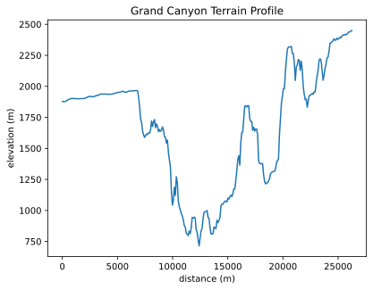
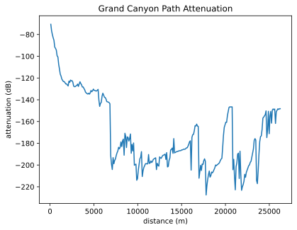

# Geoprop

This crate provides a Python API for select [geoprop] functionality.

[geoprop]: https://github.com/novalabsxyz/geoprop

## Examples

### Tiles

A single Tiles instance should be used for all geoprop operations as it gets faster with caching. But for simplicity sake, all examples will construct their own so they are self contained.


```python
from geoprop import Tiles
tiles = Tiles("nasadem/3-arcsecond/srtm/")
```

### Coverage


```python
from geoprop import Tiles, Point, Coverage, Climate

tiles = Tiles("nasadem/3-arcsecond/srtm/")

# Create a reusable coverage object contains
# less-frequently changing parameters.
coverage = Coverage(tiles, climate = Climate.Desert)

# Let's generate a coverage map for a section of the Grand Canyon
center = Point(36.159600, -112.306877, 1000)
rx_alt_m = 1
h3_res = 10
freq_hz = 900e6
radius_km = 12

# Generate coverage estimates as (h3 cell, ground elevation, attenutation dBs)
grand_canyon_estimated_coverage = coverage.estimate(center, h3_res, freq_hz, radius_km, rx_alt_m, rx_threshold_db = None)
```

### Terrain profile


```python
from geoprop import Tiles, Profile, Point
import matplotlib.pyplot as plt
import matplotlib_inline
matplotlib_inline.backend_inline.set_matplotlib_formats('svg')

tiles = Tiles("nasadem/3-arcsecond/srtm/")

start = Point(36.00413897612008, -112.2797569088778, 3)
end = Point(36.20334730019485, -112.1230717397408, 3)

grand_canyon_profile = tiles.profile(start, end)
fig, ax = plt.subplots()
ax.plot(grand_canyon_profile.distances(), grand_canyon_profile.elevation())
ax.set_title('Grand Canyon Terrain Profile')
ax.set_ylabel('elevation (m)')
ax.set_xlabel('distance (m)');
```





### Point to point attenuation


```python
from geoprop import Tiles, Profile, Point, p2p
import matplotlib.pyplot as plt

tiles = Tiles("nasadem/3-arcsecond/srtm/")

start = Point(36.00413897612008, -112.2797569088778, 3)
end = Point(36.20334730019485, -112.1230717397408, 3)

grand_canyon_profile = tiles.profile(start, end)
freq = 900e6

p2p(grand_canyon_profile, freq)
```


    148.2082131997705


### Path attenuation


```python
from geoprop import Tiles, Profile, Point, path
import matplotlib.pyplot as plt
import matplotlib_inline
matplotlib_inline.backend_inline.set_matplotlib_formats('svg')

tiles = Tiles("nasadem/3-arcsecond/srtm/")

start = Point(36.00413897612008, -112.2797569088778, 3)
end = Point(36.20334730019485, -112.1230717397408, 3)

grand_canyon_profile = tiles.profile(start, end)

freq = 900e6
grand_canyon_atten = [-dB for dB in path(grand_canyon_profile, freq)]
fig, ax = plt.subplots()
distances = grand_canyon_profile.distances()[1:]
ax.plot(distances, grand_canyon_atten)
ax.set_title('Grand Canyon Path Attenuation')
ax.set_xlabel('distance (m)')
ax.set_ylabel('attenuation (dB)');
```



